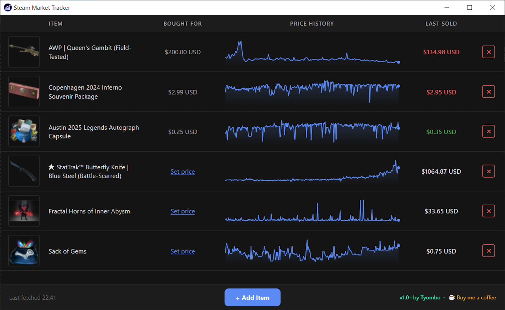

# Steam Market Tracker

A desktop app to track Steam Community Market item prices. Monitors price history, shows profit/loss vs your purchase price, and auto-refreshes every hour.

 

---

## Features

- Add items by pasting a Steam Market URL
- Track purchase price vs current price (color-coded profit/loss)
- Price history graph with hover tooltips
- Auto-refreshes every hour, synced to Steam's update schedule

---

## Usage

**Adding an item**
1. Click **+ Add Item**
2. Paste a Steam Community Market listing URL (e.g. `https://steamcommunity.com/market/listings/730/...`)
3. Optionally enter the price you paid
4. Click **Add Item** — the app fetches the name, image, and price history automatically

> Purchase price is permanent once saved — it cannot be changed later.

**Deleting an item**
Click the **✕** button on any row → confirm in the dialog.

**Setting purchase price later**
Click the **Set price** link in the BOUGHT FOR column if you skipped it when adding.



---

## Run from Source

**Requirements:** Python 3.10+, pip

```bash
# 1. Clone the repo
git clone https://github.com/youruser/steam-market-tracker.git
cd steam-market-tracker

# 2. Create and activate virtual environment
python -m venv venv
venv\Scripts\activate

# 3. Install dependencies
pip install -r requirements.txt

# 4. Run
python main.py
```

---

## Build EXE

```bash
# Install PyInstaller (once)
pip install pyinstaller

# Build
pyinstaller --noconfirm --onefile --windowed ^
  --name "Steam Market Tracker" ^
  --icon "assets/icon.ico" ^
  --add-data "styles;styles" ^
  --add-data "assets;assets" ^
  main.py
```

Output: `dist/Steam Market Tracker.exe`

> Use `--onedir` instead of `--onefile` if startup speed is important (avoids extraction on each launch).
